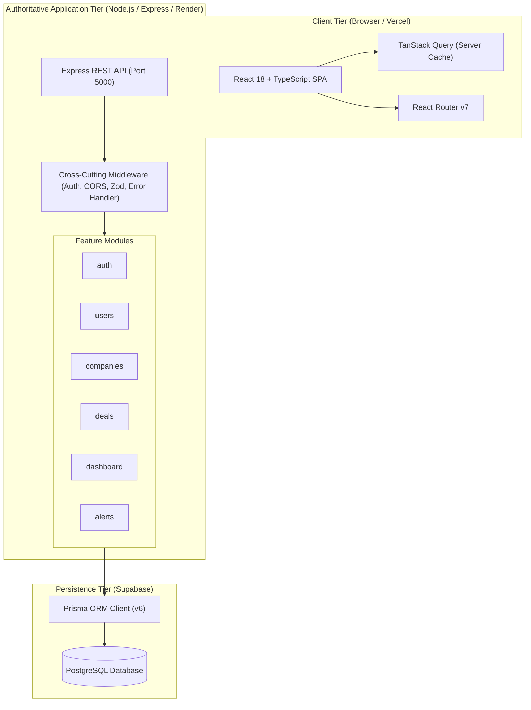
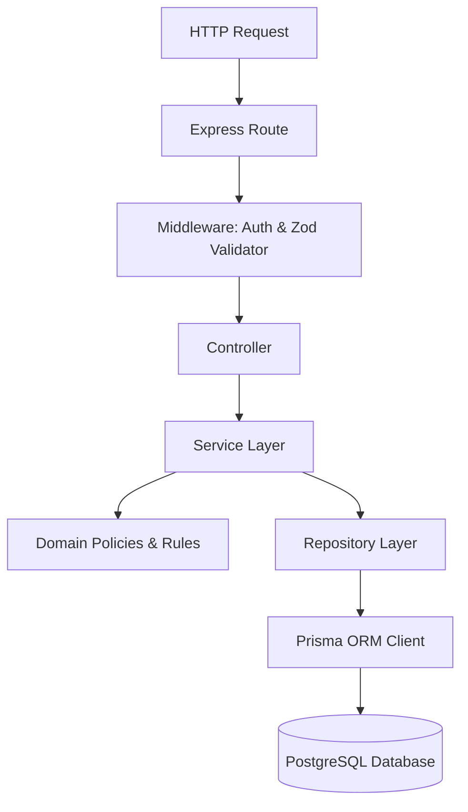
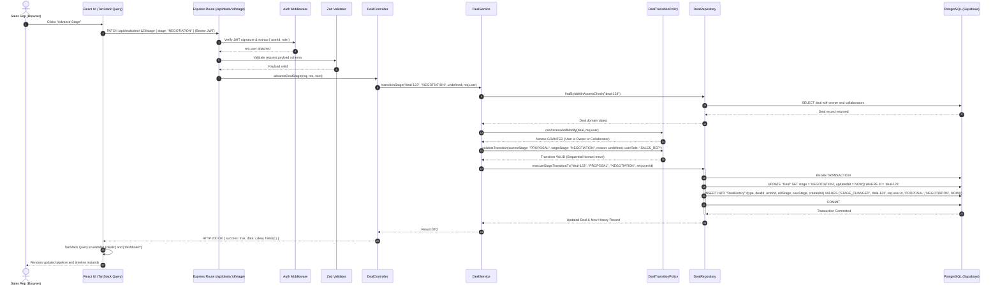
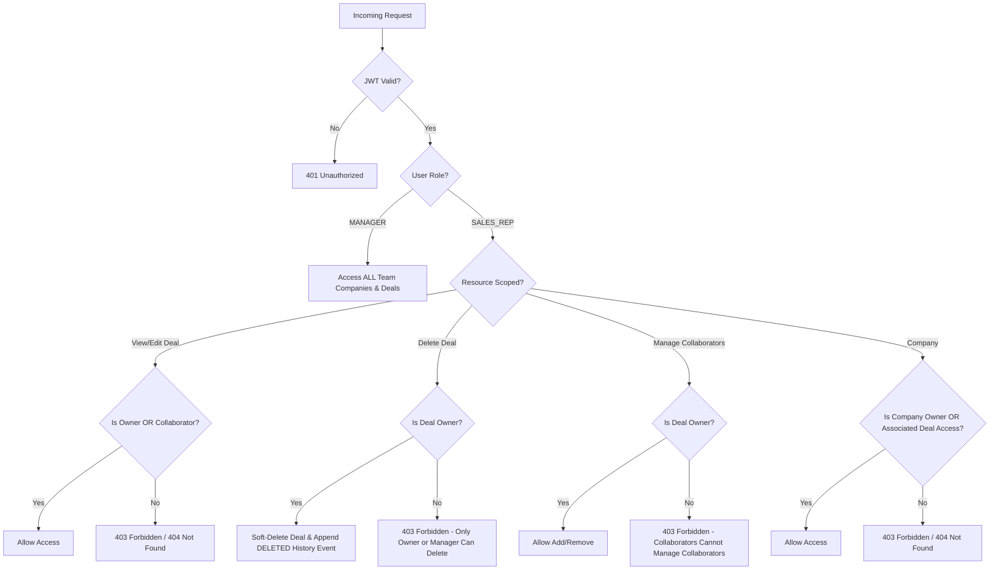

# System Architecture

This document describes the high-level architecture, module boundaries, component communication, layered responsibilities, request flows, authorization boundaries, and design principles of the Sales CRM application.

---

## 1. High-Level Architecture Overview

The system is designed as a **feature-based modular architecture with layered separation of concerns**. It separates the presentation tier (React Single-Page Application) from the authoritative application tier (Node.js/Express REST API), backed by a relational persistence layer (PostgreSQL hosted on Supabase, accessed via Prisma ORM).



### Component Placement & Execution Environments
- **Frontend SPA**: Runs in the end-user's web browser, served statically via **Vercel** (or local Vite server at `http://localhost:5173`).
- **Backend REST API**: Runs as a long-lived Node.js service hosted on **Render** (or locally at `http://localhost:5000`). It is the authoritative security, authorization, and business-rule boundary.
- **Database**: Managed PostgreSQL instance hosted on **Supabase** (Tokyo region `aws-0-ap-northeast-1`), utilizing transaction pooling (port `6543`) for application queries and session pooling (port `5432`) for schema migrations.

---

## 2. Moving Pieces & Inter-Process Communication

1. **Frontend Tier (React + TypeScript + Vite + Tailwind CSS)**:
   - Client-side navigation via React Router.
   - Server-state synchronization, background refetching, and cache invalidation via TanStack Query.
   - HTTP transport via Axios, configured with request interceptors to inject Bearer JWT credentials.
   - Lightweight visualization via Recharts for dashboard analytics.
   - Responsive, accessible UI styled with Tailwind CSS.

2. **Backend Application Tier (Express + TypeScript)**:
   - Stateless HTTP REST API.
   - Request authentication using JWT and bcrypt password verification.
   - Strict runtime request validation using Zod schemas before hitting business logic.
   - Centralized error-handling pipeline converting domain exceptions (`AppError`) into structured HTTP responses.

3. **Database Tier (Supabase PostgreSQL + Prisma ORM)**:
   - Strictly relational data model enforcing primary keys, foreign keys, unique constraints, and check conditions.
   - Prisma Client providing compile-time type safety and migration tracking.

> [!IMPORTANT]
> **Supabase Boundary Principle**: Supabase is strictly used as a managed PostgreSQL hosting provider. We do **not** use Supabase Auth, the Supabase JS Client, PostgREST Data API, Supabase Realtime, Storage, or Edge Functions. All authentication, authorization, business rules, and API endpoints are strictly executed and enforced by the Express application server.

---

## 3. Backend Module Structure & Layered Responsibilities

The backend is structured around business domains rather than horizontal technical silos. Each business domain resides in its own module under `backend/src/modules/`:

```
backend/src/
├── config/                  # Validated environment configuration (env.ts)
├── database/                # Database connection & Prisma client singleton
├── middleware/              # Cross-cutting HTTP middleware (auth, error, logging)
├── errors/                  # Standard domain error hierarchy (AppError, etc.)
├── utils/                   # Pure helper functions
├── modules/
│   ├── auth/                # Authentication, JWT issuance, login
│   ├── users/               # Team member discovery for collaborator selection
│   ├── companies/           # Company lifecycle, archiving, restore
│   ├── deals/               # Deals CRUD, lifecycle, transition policies, collaborators, timeline
│   ├── dashboard/           # Pipeline aggregations, win rates, weekly trend metrics
│   └── alerts/              # Overdue deal detection & dismissal tracking
├── app.ts                   # Express application factory & middleware pipeline
└── server.ts                # Server bootstrap & graceful shutdown
```

### Layered Dependency Direction within Modules

Within any complex module (such as `deals` or `companies`), execution flows strictly downward:



### Separation of Concerns:
- **Routes (`*.routes.ts`)**: Define HTTP verbs, URL paths, and mount relevant route-level middleware (authentication guards, role checks, validation schemas).
- **Controllers (`*.controller.ts`)**: Pure HTTP adapters. Extract query/route params and request bodies, invoke the appropriate Service method, and format the HTTP response. Controllers contain **no business logic**.
- **Services (`*.service.ts`)**: Coordinate business use cases. Manage database transactions, call domain policies to enforce rules, delegate data retrieval/mutation to repositories, and return typed domain objects.
- **Domain Policies (`*.policy.ts`)**: Pure business invariant engines. Classes such as `DealTransitionPolicy` encapsulate rules like valid stage movement, backward transition reasons, and closed-deal protection. They are decoupled from HTTP and easily unit-tested.
- **Repositories (`*.repository.ts`)**: Encapsulate all database queries and Prisma calls. Prevent Prisma query syntax from leaking across services.
- **Validators (`*.validator.ts`)**: Zod schemas that validate untrusted input payloads and query parameters at the network perimeter.

---

## 4. End-to-End Representative Request Path

### Scenario: Sales Rep Advances a Deal from Proposal to Negotiation



---

## 5. Authoritative Server-Side Authorization Boundary

Security and visibility are enforced strictly on the backend. Client-side hiding is purely for user experience:



### Deal Deletion & Trash Visibility Architecture
To honor both **Goal 3** (*"Deals can be created, edited, and deleted"*) and **Goal 9** (*"History you cannot rewrite. Nothing in this timeline can be edited or deleted after the fact"*):
1. **State-Based Soft Deletion**: "Deleting a deal" means changing its lifecycle visibility state, not physically dropping rows. The database record is retained with `deletedAt = NOW()` and `deletedById = req.user.id`.
2. **Immutable Deletion Audit Event**: Deleting a deal appends an immutable `DELETED` record to `DealHistory`, recording who deleted the deal (`actorId`) and when (`createdAt`). Previous history events are never deleted or truncated.
3. **Active vs. Deleted (Trash) Views**:
   - **Active Views**: Pipelines, company detail deal lists, search, filters, CSV exports, and dashboard metrics exclude deleted deals by default (`WHERE "deletedAt" IS NULL`).
   - **Deleted / Trash View**: Dedicated view querying deleted deals (`WHERE "deletedAt" IS NOT NULL`). Users can identify the deal, its company, deletion date, and deleting actor. Opening a deleted deal in Trash still allows its complete immutable timeline to be inspected.
4. **Planned Restore Capability**: The architecture leaves clean room for a future restore action from Trash. Detailed restore permissions and API behaviors are marked **TBD** and not prematurely implemented.
5. **Separate Company vs. Deal Mechanics**:
   - **Company**: Uses `isArchived: boolean` (Goal 2 archive/restore; existing deals remain intact).
   - **Deal**: Uses `deletedAt: timestamp?` and `deletedById: uuid?` (soft-delete to Trash with complete history retained).

### Authorization Matrix

| Capability | Sales Rep | Sales Manager | Enforcement Point & Repository Rule |
| :--- | :---: | :---: | :--- |
| **View Companies** | **Scoped only**: companies they own, OR associated with deals they own/collaborate on | All team companies | `CompanyRepository`: `WHERE teamId = :teamId AND (ownerId = :userId OR id IN (SELECT companyId FROM "Deal" WHERE (ownerId = :userId OR id IN (SELECT dealId FROM "DealCollaborator" WHERE userId = :userId)) AND deletedAt IS NULL))` |
| **Create Company** | Direct (self-assigned owner) | Direct (must explicitly assign team Sales Rep) | `CompanyService` validation (enforces Sales Rep owner) |
| **Edit / Archive Company** | Owned companies only | All team companies | `CompanyPolicy.canModify()` |
| **View Active Deals** | **Scoped only**: deals they own, OR collaborate on | All team deals | `DealRepository`: `WHERE deletedAt IS NULL AND (ownerId = :userId OR id IN (SELECT dealId FROM "DealCollaborator" WHERE userId = :userId))` |
| **View Deleted Deals (Trash)**| **Scoped only**: deleted deals they owned or collaborated on | All team deleted deals | `DealRepository`: `WHERE deletedAt IS NOT NULL AND ...` (scoped by role) |
| **Create Deal** | Direct on accessible companies (self-assigned owner) | Direct on any team company (must explicitly assign team Sales Rep) | `DealService` & `DealPolicy.canCreate` (enforces Sales Rep owner, blocks creation on archived companies) |
| **Edit Deal Details** | Owned or collaborated deals | All team deals | `DealPolicy.canModify()` (blocks edits on soft-deleted deals) |
| **Advance / Move Back Deal** | Owned or collaborated deals | All team deals | `DealTransitionPolicy` (enforces 1-step, reason on backward, closed restrictions) |
| **Delete Deal** | **Deal Owner only** (on owned deals) | **Allowed on any deal** in team | `DealPolicy.canDelete()`: Sets `deletedAt` & `deletedById`; appends immutable `DELETED` event in `DealHistory`. Physical row and history remain intact. |
| **Reopen Closed Deal** | ❌ Forbidden | ✅ Allowed (returns to `previousStage`) | `DealTransitionPolicy.canReopen()` (Manager role required) |
| **Reassign Deal Owner** | ❌ Forbidden | ✅ Allowed (single & bulk) | `DealPolicy.canReassign()` (Manager role required); atomically cleans up new owner from `DealCollaborator` relation in database transaction |
| **Manage Collaborators** | Allowed **only if rep is Deal Owner** (collaborators cannot manage other collaborators) | **Allowed on any deal** in team | `DealPolicy.canManageCollaborators()`: Only Sales Manager OR Deal Owner can add/remove collaborators (`POST /api/deals/:id/collaborators` and `DELETE /api/deals/:id/collaborators/:userId`) |
| **Bulk Actions & CSV** | CSV export for accessible deals | Bulk reassign, bulk advance, CSV | `DealService` & `BulkDealService` (operates on active open deals) |
| **Overdue Alerts** | View & dismiss own overdue deals | View all team overdue deals | `AlertPolicy` & `AlertRepository` (filtered to `deletedAt IS NULL`) |
| **Audit History** | Read accessible deal timeline | Read all deal timelines | Append-only: `DealHistory` is permanent; soft deletion appends `DELETED`; zero update/delete API routes |

### Deal & Company Ownership Creation Model

Deal ownership follows the same creation principle as company ownership: Managers explicitly select a Sales Rep as Deal Owner, while Sales Reps automatically own deals they create. A Manager is never automatically assigned as Deal Owner merely because they created the deal.

### Deal Lifecycle State Machine

The deal stage progression follows a strict, assignment-mandated linear state machine enforced in `DealTransitionPolicy`:

```
NEW → QUALIFIED → PROPOSAL → NEGOTIATION → WON (Closed / Terminal)
                                          → LOST (Closed / Terminal, requires non-empty reason)
```

**Core Lifecycle Principles:**

1. **Assignment-Defined Forward Progression**: Exactly 1 step forward at a time (`NEW → QUALIFIED → PROPOSAL → NEGOTIATION`). Multi-step skips (e.g., `NEW → PROPOSAL`) are rejected with `400 Bad Request`.
2. **Terminal Closed Outcomes (`WON` and `LOST`)**:
   - `WON` and `LOST` can **only** be reached from `NEGOTIATION`.
   - Attempting to mark a deal as `WON` or `LOST` directly from `NEW`, `QUALIFIED`, or `PROPOSAL` is rejected with `400 Bad Request` on the server and blocked in the UI. This strictly reflects the assignment specification defining Won and Lost as outcomes of the Negotiation stage.
   - Both `WON` and `LOST` are closed, terminal states. Once closed, standard transitions are disabled and the deal can only be re-activated via Manager Reopen.
3. **Mandatory Lost Reason**: Transitioning to `LOST` strictly requires a non-empty `reason` string (`reason.trim().length > 0`). Empty or whitespace-only inputs are rejected with `400 Bad Request` by the server and enforced via a dedicated confirmation dialog in the UI. The loss reason is permanently stored in `DealHistory`.
4. **Backward Progression**: Exactly 1 step backward (e.g., `NEGOTIATION → PROPOSAL`, `PROPOSAL → QUALIFIED`, `QUALIFIED → NEW`) and requires a mandatory non-empty reason explaining the regression. `NEW` deals cannot move backward. Multi-step regressions are rejected with `400 Bad Request`.
5. **Server-Side Persisted `previousStage` for Reopen**:
   - When a deal is closed (`WON` or `LOST`), the backend atomically records the pre-close stage in `Deal.previousStage` and timestamps `closedAt: new Date()`.
   - When a Sales Manager reopens the deal (`POST /api/deals/:id/reopen`), the backend uses the server-persisted `deal.previousStage` value, verifies it represents a valid open stage, restores `deal.stage = deal.previousStage`, clears `closedAt = null`, and logs a `REOPENED` event in `DealHistory`.
   - **Architectural Distinction**: In the current assignment lifecycle, because Won and Lost are only reached from `NEGOTIATION`, all legitimately closed deals have `previousStage = NEGOTIATION` and therefore reopen to `NEGOTIATION`. This is a natural consequence of the assignment rules, **not** a hard-coded assumption in the reopen service. The service dynamically relies on `Deal.previousStage`, ensuring complete backend authority and forward extensibility.
6. **Company Archive/Restore vs. Deal Reopen**: These are distinct concepts:
   - **Deal Reopen**: Restores a closed deal (`WON`/`LOST`) to its previous active pipeline stage.
   - **Company Archive / Restore**: Toggles company operational status (`ACTIVE ↔ ARCHIVED`) without altering associated deal stages or histories.

---

## 6. What Was Deliberately NOT Built (Scope & Complexity Guardrails)

To remain strictly within the ~12-hour engineering budget while maximizing maintainability and correctness, the following systems were deliberately excluded:

1. **Multi-Tenancy SaaS Infrastructure**:
   - *Excluded*: Organization switchers, tenant isolation middleware, subscription tiers, billing engines, cross-team dashboards.
   - *Rationale*: The assignment targets a single sales team. While `Organization` and `Team` entities exist in the schema for clean structural extensibility, the application seeds and operates on exactly one organization and one team.
2. **Microservices & Message Brokers (Kafka / RabbitMQ / Redis)**:
   - *Excluded*: Distributed event streaming, external pub/sub, Redis caching.
   - *Rationale*: A modular monolith with co-located business modules is substantially simpler to reason about, test, deploy, and verify. PostgreSQL provides full transactional integrity.
3. **WebSockets / Server-Sent Events**:
   - *Excluded*: Live socket streaming for pipeline updates.
   - *Rationale*: Standard TanStack Query polling and cache invalidation provide instant UI responsiveness without connection leaks, heartbeat management, or socket server overhead.
4. **GraphQL**:
   - *Excluded*: GraphQL resolvers, schemas, and client cache complexities.
   - *Rationale*: Explicit REST endpoints paired with Zod contracts offer predictable HTTP status codes, straightforward caching, and rapid implementation.
5. **Generic Approval Workflow Engine**:
   - *Excluded*: `ApprovalRequest` entity with pending states for creations.
   - *Rationale*: Direct company and deal creation is the expected standard CRM flow. Introducing approval bottlenecks for every rep creation would degrade usability and exceed assignment scope.
6. **Deep Class Inheritance Hierarchies**:
   - *Excluded*: Abstract base controllers, generic repository base classes, entity class hierarchies (`Manager extends User`).
   - *Rationale*: Favor composition and dependency injection over inheritance. Roles are represented as typed data/enums, not subclasses.
7. **Physical Deal Purge / Automated Retention Workflows**:
   - *Excluded*: Scheduled hard-delete cron jobs, background purge workers, separate audit databases.
   - *Rationale*: Soft deletion with an append-only timeline completely fulfills both Goal 3 and Goal 9 without introducing distributed cleanup complexities.

---

## 7. Scalability & Query Performance Strategy

At 100x data volume (~100,000+ deals, ~1,000,000+ history events), the system maintains stability through targeted database and query design:

1. **Server-Side Pagination & Bounded Windows**:
   - All deal and company discovery queries require `page` and `limit` parameters, returning total record counts via indexed queries. Unbounded `findMany()` calls are forbidden.
2. **Targeted Composite Indexing**:
   - Indexed foreign keys and search paths: `(teamId, deletedAt)`, `(teamId, stage, expectedCloseDate)`, `(dealId, userId)`, and `(companyId, isArchived)`.
3. **Calendar Date Arithmetic**:
   - `Deal.expectedCloseDate` is stored as a PostgreSQL `DATE` (`@db.Date`), eliminating timezone conversion overhead and ensuring index scans on date boundaries operate at peak performance.
4. **Zero N+1 Queries**:
   - Prisma `include` and relational joins are strictly structured to fetch deals with company names and collaborator avatars in a single round-trip.
5. **Dynamic Value Derivation over Stale Denormalization**:
   - Weighted pipeline values (`deal.value * stage.probability`) are computed dynamically in SQL or service aggregation, preventing data synchronization anomalies.
6. **Append-Only History Scaling**:
   - `DealHistory` is indexed on `(dealId, createdAt DESC)`. Because deals are soft-deleted, history records remain permanently attached to their parent deals without risk of cascade drops or orphaned rows. At extreme scale, PostgreSQL declarative table partitioning by `createdAt` or range hash on `dealId` can be adopted without changing application business logic.
