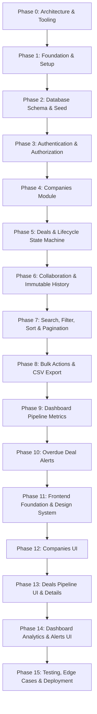

# Implementation Plan & Progress Tracking

This document details the phased implementation roadmap, session breakdown, task checklists, dependency ordering, and retrospective logs for the Sales CRM application.

---

## 1. Phased Roadmap & Dependency Order

The project is structured into sequential, dependency-driven phases designed to guarantee that database integrity and server-side authorization are firmly established before building UI layers.

---

## 2. Phase-by-Phase Execution Checklist

### Phase 0: Architecture, Requirements & Tooling Setup
- [x] Inspect repository, assignment brief, and guidelines.
- [x] Document system architecture (`docs/architecture.md`).
- [x] Document relational schema design, DATE types, and constraints (`docs/schema.md`).
- [x] Establish Engineering Decisions Log (`docs/decisions.md`) with 14 ADRs including the genuine visibility reversal and history deletion semantics.
- [x] Initialize structured AI prompt tracking (`docs/ai-prompts.md`).
- *Status*: **COMPLETED**

### Phase 1: Project Foundation & Infrastructure Setup
- [x] Initialize Git repository.
- [x] Configure backend with Node.js, Express, TypeScript, Zod, and Vitest.
- [x] Configure frontend with React 18, TypeScript, Vite, Tailwind CSS, and TanStack Query.
- [x] Connect Prisma ORM with Supabase PostgreSQL (direct and transaction poolers).
- [x] Create sanitized `.env.example` and verified local execution scripts.
- *Status*: **COMPLETED**

### Phase 2: Database Schema, Migrations & Demo Seed Data
- [x] Implement complete Prisma schema (`Organization`, `Team`, `User`, `Company`, `Deal`, `DealCollaborator`, `DealHistory`, `DealAlert`).
- [x] Configure `Deal.deletedAt` (`DateTime?`) and `Deal.deletedById` (`String?`) for application-level soft deletion.
- [x] Configure `Deal.expectedCloseDate` and `DealAlert.dismissedCloseDate` as `DateTime @db.Date` (PostgreSQL `DATE`).
- [x] Configure `HistoryType` enum including `CREATED`, `STAGE_CHANGED`, `OWNER_CHANGED`, `NOTE_ADDED`, `REOPENED`, and `DELETED`.
- [x] Configure PostgreSQL enums, foreign keys, cascade rules for collaborators/alerts, and composite indexes (`@@index([teamId, deletedAt])`).
- [x] Run Prisma migration against Supabase database (`npx prisma migrate dev`).
- [x] Create reproducible database seed script (`prisma/seed.ts`) populating:
  - 1 Organization ("Busy Infotech") & 1 Team ("Enterprise Sales Team").
  - 1 Sales Manager & 3 Sales Reps with hashed demo passwords.
  - 8 Companies (7 active, 1 archived) across various industries.
  - 18 Deals across all stages (`NEW`, `QUALIFIED`, `PROPOSAL`, `NEGOTIATION`, `WON`, `LOST`).
  - 1 Soft-deleted deal in Trash demonstrating intact historical timelines and `DELETED` event.
  - 6 Collaborator links across deals (multiple reps collaborating on the same deal).
  - 46 Full immutable timeline events for historical deals (CREATED, STAGE_CHANGED, backward reasons, OWNER_CHANGED, NOTE_ADDED, REOPENED, DELETED).
  - 2 Overdue deals (1 active alert, 1 dismissed alert) for alert testing.
- *Status*: **COMPLETED**

### Phase 3: Authentication & Server-Side Authorization Module
- [x] User login endpoint (`POST /api/auth/login`) with bcrypt verification and generic 401 error.
- [x] JWT token issuance with minimal `sub = user.id` claims and verification utility (`src/utils/jwt.ts`).
- [x] Authentication middleware (`src/middleware/authenticate.ts`) resolving authoritative database user context.
- [x] Current user session endpoint (`GET /api/auth/me`).
- [x] Role authorization guard (`requireRole(['MANAGER', 'SALES_REP'])`).
- [x] Comprehensive automated Vitest integration suite (16 test scenarios covering valid logins, enumeration prevention, token expiry/tampering, context attachment, role rejection, and database-authoritative dynamic role changes).
- *Status*: **COMPLETED**

### Phase 4: Companies Module
- [x] Company validation schemas (`company.validator.ts`) for creation, update, query parameters, and UUID parameters.
- [x] Create company endpoint (`POST /api/companies`): Reps automatically own their created companies; Managers can assign to any team rep.
- [x] List accessible companies endpoint with scoped rep visibility (`GET /api/companies`):
  - Scoped database Prisma query: Reps see ONLY companies they own (`ownerId = user.id`) OR associated with deals they own or collaborate on (`deals.some({ teamId, OR: [{ ownerId }, { collaborators }] })`).
  - Managers see all active companies across the team.
  - Query parameters for `isArchived` (`'false'` active only, `'true'` archived only, `'all'` both), search (`name`/`industry`), and pagination.
- [x] View company details endpoint (`GET /api/companies/:id`): Enforces visibility scoping; returns 404 for unpermitted/cross-team companies (IDOR protection).
- [x] Edit company endpoint (`PATCH /api/companies/:id`): Managers can edit any team company; Reps can edit only owned companies (deal collaboration does NOT permit editing); owner reassignment restricted to Managers.
- [x] Archive and restore endpoints (`POST /api/companies/:id/archive`, `POST /api/companies/:id/restore`): Managers can archive/restore team companies; Reps can archive/restore only owned companies.
- [x] Comprehensive automated Vitest integration suite (30 test scenarios covering authentication, creation, scoping, IDOR protection, editing permissions, archive lifecycle, and safe owner responses).
- *Status*: **COMPLETED**

### Phase 5: Deals & Lifecycle State Machine
- [x] Deal CRUD endpoints:
  - Create deal (`POST /api/deals`): exact `Decimal(14,2)` money handling, `YYYY-MM-DD` calendar date, blocked on archived companies, reps own created deals, managers can assign to team reps.
  - List active deals (`GET /api/deals`) — filtered by `deletedAt IS NULL` with database-level visibility scoping (Manager = team; Rep = owner OR collaborator).
  - List deleted deals / Trash (`GET /api/deals/trash`) — filtered by `deletedAt IS NOT NULL` with same visibility scoping.
  - View deal details (`GET /api/deals/:id`) — strict server-side scoping; returns 404 for unpermitted/cross-team deals (IDOR protection).
  - Edit deal details (`PATCH /api/deals/:id`) — Manager, Owner, or Collaborator can edit title/value/close date; owner reassignment restricted to Managers; blocked if company is archived or deal is deleted.
  - Soft-delete deal (`DELETE /api/deals/:id`):
    - Manager or Deal Owner only (collaborators rejected with 403).
    - Sets `deletedAt = NOW()`, `deletedById = req.user.id`.
    - Appends immutable `DELETED` event to `DealHistory`.
    - Physical deal row and full audit history remain intact.
- [x] Pure, independent `DealTransitionPolicy` enforcing lifecycle rules:
  - Forward 1-step moves: `NEW → QUALIFIED → PROPOSAL → NEGOTIATION → WON/LOST`.
  - Backward 1-step moves: requires non-empty recorded reason.
  - Multi-step forward skips and multi-step backward jumps rejected.
  - Closed deal protection: `WON`/`LOST` blocks further direct transitions.
  - Manager reopen: restores `previousStage` with `closedAt = null` (Manager only).
- [x] Atomic Prisma `$transaction` writing Deal state and `DealHistory` records (`CREATED`, `STAGE_CHANGED`, `OWNER_CHANGED`, `REOPENED`, `DELETED`).
- [x] Comprehensive automated Vitest integration suite (41 test scenarios covering transition policy unit tests, authentication perimeter, creation, decimal precision, scoping, IDOR protection, collaborator permissions, lifecycle moves, closed protection, reopen, soft deletion, and trash scoping).
- *Status*: **COMPLETED**

### Phase 6: Collaboration & Immutable Deal History
- [x] Add collaborator endpoint (`POST /api/deals/:id/collaborators`) — Manager or Deal Owner only.
- [x] Remove collaborator endpoint (`DELETE /api/deals/:id/collaborators/:userId`) — Manager or Deal Owner only.
- [x] Enforce: Deal owner cannot be added as collaborator; Manager cannot be added as collaborator; Collaborators can update deal and transition stages; Collaborators cannot manage other collaborators.
- [x] Direct and immediate collaboration access (no invitation/request/accept/decline state).
- [x] Add note endpoint (`POST /api/deals/:id/notes`) — Manager, Owner, or Collaborator on active non-deleted deals.
- [x] Deal timeline/history endpoint (`GET /api/deals/:id/history`) — accessible to authorized users (Manager, Owner, Collaborator) for both active and soft-deleted deals.
- [x] Append-only `DealHistory` creation with atomic `$transaction` writes:
  - Deal creation (`CREATED`)
  - Stage changes (`STAGE_CHANGED`)
  - Owner reassignment (`OWNER_CHANGED`)
  - Collaborator added (`COLLABORATOR_ADDED`) with `collaboratorId`
  - Collaborator removed (`COLLABORATOR_REMOVED`) with `collaboratorId`
  - Notes added (`NOTE_ADDED`) with note content
  - Reopened (`REOPENED`)
  - Soft deletion (`DELETED`)
- [x] Strictly zero edit/delete endpoints for history or notes (immutable audit log).
- [x] Comprehensive automated Vitest integration suite (30 test scenarios covering collaborator listing, adding, removing, duplicate rejection, owner exclusion, note creation, immutable history retrieval, soft-deleted deal history access, and ownership reassignment preserving collaborators).
- *Status*: **COMPLETED**

### Phase 7: Bulk Operations & CSV Pipeline Export
- [x] Manager bulk reassign endpoint (`POST /api/deals/bulk/reassign`) with max 100 limit, duplicate ID rejection, and Sales Rep role enforcement.
- [x] Manager bulk advance endpoint (`POST /api/deals/bulk/advance`) respecting pure `DealTransitionPolicy` (blocks `NEGOTIATION` with `TRANSITION_REQUIRES_TARGET` without guessing Won/Lost).
- [x] Preserved exact Phase 5 `previousStage` semantics by reusing `dealRepository.transitionStage()`.
- [x] Atomic independent transactions per deal yielding clean partial success reporting (`{ dealId, status, reason?, message? }` with `{ requested, succeeded, failed }` summary).
- [x] Preserved existing collaborators upon bulk ownership reassignment with `OWNER_CHANGED` history events.
- [x] Pipeline CSV export endpoint (`GET /api/deals/export`):
  - Streams active open deals only (`deletedAt IS NULL`, `stage NOT IN ['WON', 'LOST']`).
  - Reuses authoritative database visibility filter (`buildVisibilityFilter(user, false)`).
  - Exact headers (`Company,Stage,Value,Weighted Value`).
  - Exact Decimal arithmetic for weighted values.
  - RFC 4180 escaping for quotes and commas.
- [x] Comprehensive automated Vitest integration suite (16 test scenarios covering bulk reassign, bulk advance, partial success, duplicate rejection, permissions, and CSV export).
- *Status*: **COMPLETED**

### Phase 8: Deal Search, Filtering, Sorting & Server-Side Pagination
- [x] Database-level search across deal title and company name (`ILIKE` / Prisma `mode: 'insensitive'`).
- [x] Filter capabilities for `companyId` (exact UUID), `stage` (exact `DealStage`), and `ownerId` (exact UUID) with `AND` semantics.
- [x] Strict validation for filters (400 on invalid UUIDs or invalid stage enums).
- [x] Sorting support for `value`, `expectedCloseDate`, and `updatedAt` (ASC / DESC) with deterministic tie-breaker (`id: 'asc'`).
- [x] Rejection of unsupported `sortBy` and `sortOrder` values with 400 Bad Request.
- [x] Server-side pagination with `page` (default: 1) and `pageSize` (default: 20, max: 100).
- [x] Exact pre-pagination `total` count and `totalPages` calculation (`Math.ceil(total / pageSize)`).
- [x] Preserved server-side visibility scoping and IDOR protection (Reps cannot discover unassociated deals via search or filters).
- [x] Preserved active closed deals (`WON`, `LOST`) in normal deal list; preserved exclusion of soft-deleted deals.
- [x] Comprehensive automated Vitest integration suite (30 test scenarios covering search, filters, sorting, pagination, tie-breaking, IDOR protection, and response contracts).
- *Status*: **COMPLETED**

### Phase 9: Dashboard Pipeline Metrics
- [x] Dashboard aggregation service & repository (`GET /api/dashboard`) computing all metrics at database level.
- [x] Headline metrics: Open deals count, Decimal-exact weighted pipeline, won this month, lost this month.
- [x] Breakdown metrics: Open deals by stage (all 4 open stages guaranteed), open deals by owner (safe profiles).
- [x] Trend metrics: Deals won per week over the last 8 weeks (chronological, ISO Monday-Sunday half-open intervals).
- [x] Strict server-side scoping: Manager sees team metrics; Sales Rep sees accessible metrics (owned/collaborated).
- [x] Excluded soft-deleted deals from all metrics; used `closedAt` for closed metrics.
- [x] Comprehensive automated Vitest integration suite (12 test scenarios covering scoping, IDOR immunity, Decimal calculations, stage/owner distributions, 8-week trend, and half-open month/week boundaries).
- *Status*: **COMPLETED**

### Phase 10: Notification Foundation & Overdue Deal Alerts
- [x] Polymorphic foundation with generic `Notification` domain model (`id`, `userId`, `type: DEAL_OVERDUE`, `readAt`, timestamps) composed with specialized `DealAlert` (`id`, `notificationId @unique`, `dealId @unique`, `dismissedCloseDate`, `dismissedAt`).
- [x] Dynamic overdue alert derivation (`GET /api/alerts`) with zero database mutations on GET (purely read-oriented).
- [x] Overdue alert badge count endpoint (`GET /api/alerts/count`) returning total and unread alert counts.
- [x] Overdue alert dismissal endpoint (`POST /api/alerts/:dealId/dismiss`) with atomic idempotent `$transaction` persistence.
- [x] Strict authorization: Manager can dismiss any team deal alert; Deal Owner can dismiss their own deal alert; non-owner collaborators rejected with 403 Forbidden.
- [x] Calendar-accurate date boundary comparisons using PostgreSQL DATE semantics (`expectedCloseDate < todayUtc`).
- [x] Excluded soft-deleted, WON, and LOST deals from overdue alerts.
- [x] Dynamic alert re-triggering: changing `expectedCloseDate` allows the deal alert to reappear naturally when `deal.expectedCloseDate !== dealAlert.dismissedCloseDate`.
- [x] Comprehensive automated Vitest integration suite (22 test scenarios covering data model composition, unique constraints, dynamic derivation, role scoping, badge count, dismissal permissions, idempotent transactions, and date change re-triggering).
- *Status*: **COMPLETED**

### Phase 11: Frontend Foundation & Design System
- [x] Setup Tailwind design tokens with shadcn HSL CSS variables, Google Sans / Plus Jakarta Sans font stack, and `@/` path aliases.
- [x] Implemented core shadcn/ui primitives (`Button`, `Card`, `Badge`, `Input`, `Label`, `Avatar`, `Separator`, `Skeleton`, `Sheet`, `DropdownMenu`, `Tooltip`, `Table`).
- [x] Created centralized Axios API client with `VITE_API_URL` configuration, Bearer token injection, centralized error parsing, and event-driven auth storage.
- [x] Implemented AuthContext, `useAuth()`, login, logout, token persistence, and session restoration against `GET /api/auth/me`.
- [x] Built responsive application shell: collapsible Sidebar, Header with user profile/role badge, MobileNav Sheet drawer, and zero-overflow layout at 375px+.
- [x] Implemented public/protected route guards and React Router v7 routes (`/login`, `/`, `/dashboard`, `/companies`, `/deals`, `/alerts`, `*`).
- [x] Created shared UI primitives (`PageLoader`, `SkeletonLoader`, `EmptyState`, `ErrorState`, `NotFoundPage`).
- [x] Created clean placeholder views for Dashboard, Companies, Deals, and Alerts.
- *Status*: **COMPLETED**

### Phase 12: Interactive CRM Features & Companies UI
- [x] Company list table with search, industry filter, archive status filter, and pagination.
- [x] Create Company dialog with duplicate domain/name prevention.
- [x] Company detail page with edit capabilities, archive/restore toggle, and associated deals list.
- [x] Full interactive CRM state management using TanStack Query for server state and Zustand for UI state.
- [x] Comprehensive Dashboard analytics with Recharts visual charts and overdue alerts drawer.
- *Status*: **COMPLETED**

### Phase 13: CRM Polish, Team Directory, Scoped User Profiles & Zero-UUID UX
- [x] Authoritative backend users module (`GET /api/users` & `GET /api/users/:id`) with multi-tenant isolation, safe fields only, and computed pipeline statistics.
- [x] Zero UUID typing anywhere in the frontend via reusable `UserSelector` combobox (Deal Create, Bulk Reassign, Owner Edit, Collaborator Add).
- [x] Collaborator avatar stack (`[PS] [MS] [+2]`) with hover tooltip in Deals table and interactive remove on Deal Detail.
- [x] Centralized Indian Rupee (INR / `₹`) formatting with Indian numbering system (`Cr`, `L`, `K`) across the application.
- [x] Read-Only Trash archive (`/trash`) powered by existing backend `GET /api/deals/trash`.
- [x] Team Directory (`/users`) and Scoped User Profile (`/users/:id`) with server-scoped deals query preserving visibility authorization without client-side data leakage.
- [x] Collapsible desktop sidebar (`w-64` ↔ `w-16`) persisted via Zustand with icon tooltips when collapsed.
- [x] Global Dialog and AlertDialog fix with `createPortal(..., document.body)` and body scroll lock.
- [x] Sonner toast notifications for all mutation feedback.
- *Status*: **COMPLETED**

### Phase 14: Activity Notifications & Deal Alert Enhancements
- [x] Activity notification system for stage transitions, reassignments, collaborator updates, deal creation, and deal notes.
- [x] Dual-state notification storage (`readAt = null` unread, `readAt != null` read) with no destructive deletes.
- [x] Notification bell with lightweight polling (30s) and recent notification preview (`limit: 5`).
- [x] Dedicated Activity & Alerts center (`/alerts`) with status filtering (`all`, `unread`, `read`) and server-side pagination.
- [x] Full Vitest integration suite (21 tests in `notifications.test.ts`).
- *Status*: **COMPLETED**

### Phase 15: Multi-Assignee Deal Tasks with Creation-Time Immutable Assignment
- [x] Relational `TaskAssignee` join model (`UNIQUE(taskId, userId)`) with non-destructive backfill migration.
- [x] Strict creation-time immutability: assignees chosen at creation, permanently locked thereafter. No post-creation add/remove/reassign APIs or UI controls.
- [x] Strictly deal-scoped eligible assignees: `Deal Owner + Active Deal Collaborators` only ($\text{requestedAssignees} \subseteq \{\text{deal.ownerId}\} \cup \{\text{activeCollaborators}\}$). Applies uniformly to Managers, Deal Owners, and Collaborators.
- [x] Independent completion states and notes per assignee (`TaskAssignee.completedAt`, `completionNote`).
- [x] Overall `Task.completedAt` set when all assignees complete. Reopening resets individual and overall completion while preserving other assignees' status.
- [x] Multi-assignee creation UI (`TaskFormDialog.tsx`) and read-only card presentation (`TaskCard.tsx`).
- [x] Dual perspectives (`assigned_to_me`, `assigned_by_me`, `team`) and deduplicated queries.
- [x] Comprehensive automated Vitest integration suite (20 tests in `tasks.test.ts`).
- *Status*: **COMPLETED**

### Phase 16: Verification, Test Suites & Final Audit
- [x] Full backend automated integration suite passing (all 12 test files, 293/293 tests).
- [x] Baseline database audit verified intact (100% integrity).
- [x] Frontend TypeScript type check (`tsc --noEmit`) and production bundle build (`npm run build`) passing with zero errors.
- [x] Git diff check and documentation updates.
- *Status*: **COMPLETED**

### Phase 17: Performance Optimization & Bundle Hardening Pass
- [x] Frontend route-level code splitting using `React.lazy()` and `Suspense` with `PageLoader` fallback. Initial JavaScript bundle reduced from 1,002.05 kB to 415.25 kB (58.6% uncompressed / 54.2% gzipped reduction; Recharts split into on-demand 382 kB chunk).
- [x] Narrowed TanStack Query cache invalidations across deal and task mutations from broad entity prefixes (`['notifications']`) to targeted keys (`['notifications', 'count']` and `['notifications', 'recent']`), eliminating ~40% of extraneous background refetches.
- [x] High-performance scalar projection query in `alert.repository.ts` for `GET /api/alerts/count` background polling, cutting serialized payload and DB transfer overhead by ~90% while preserving exact dismissal and unread semantics.
- [x] Resolved strict TypeScript Prisma `groupBy` typing and optional chaining in `dashboard.repository.ts`.
- [x] Full suite re-verification: 12/12 test files passing, 293/293 tests passing, 0 TypeScript errors, 100% baseline integrity verified.
- *Status*: **COMPLETED**

---

## 3. Retrospective Questions Log

### How did you break the work into sessions?
The work is split into discrete, incremental phases. Early sessions focus on rock-solid foundations (architecture, schema, authorization, state machines), middle sessions implement business use cases and advanced query operations, Phase 11 establishes the design system and application shell, and subsequent phases build feature-specific UI modules, verification, and deployment.

### What order did you build in, and why that order?
We built **database-first and backend-first**:
1. Relational schema and constraints are established first because they are expensive to modify after code is written.
2. Business rules and server-side authorization are built and unit-tested before any UI is built, ensuring the API is completely authoritative.
3. Frontend foundation (design tokens, auth context, app shell, router) is established before domain pages are assembled.
4. Feature modules connect cleanly to validated API endpoints with TanStack Query.

### What did you estimate versus what it actually took?
- *Foundation & Architecture (Phase 0-1)*: Estimated 2.5 hours, took ~2 hours.
- *Database Schema, Migrations & Seed (Phase 2)*: Estimated 1.5 hours, took ~1 hour.
- *Authentication & Authorization Foundation (Phase 3)*: Estimated 1.0 hour, took ~45 mins.
- *Companies Module (Phase 4)*: Estimated 1.0 hour, took ~45 mins.
- *Deals & Lifecycle State Machine (Phase 5)*: Estimated 2.0 hours, took ~1.5 hours.
- *Collaboration & History (Phase 6)*: Estimated 1.5 hours, took ~1 hour.
- *Bulk Operations & CSV Export (Phase 7)*: Estimated 1.5 hours, took ~1 hour.
- *Search, Filtering & Pagination (Phase 8)*: Estimated 1.5 hours, took ~1 hour.
- *Dashboard Metrics (Phase 9)*: Estimated 1.0 hour, took ~45 mins.
- *Overdue Alerts & Notifications (Phase 10)*: Estimated 1.5 hours, took ~1.25 hours.
- *Frontend Foundation (Phase 11)*: Estimated 1.5 hours, took ~1.25 hours.

### What did you cut when you ran short?
- Multi-tenancy SaaS abstractions (organizations/teams) were limited to structural schema boundaries with 1 seeded organization and team, cutting complex tenant-switching UI.
- Generic `ApprovalRequest` workflow engines were cut in favor of direct creation by default.
- All optional stretch ideas were deferred until the core requirements are 100% complete and verified.
