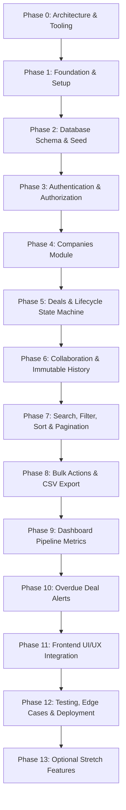

# Implementation Plan & Progress Tracking

This document details the phased implementation roadmap, session breakdown, task checklists, dependency ordering, and retrospective logs for the Sales CRM application.

---

## 1. Phased Roadmap & Dependency Order

The project is structured into 13 sequential, dependency-driven phases designed to guarantee that database integrity and server-side authorization are firmly established before building UI layers.

---

## 2. Phase-by-Phase Execution Checklist

### Phase 0: Architecture, Requirements & Tooling Setup
- [x] Inspect repository, assignment brief, and guidelines.
- [x] Document system architecture (`docs/architecture.md`).
- [x] Document relational schema design, DATE types, and constraints (`docs/schema.md`).
- [x] Establish Engineering Decisions Log (`docs/decisions.md`) with 14 ADRs including the genuine visibility reversal and history deletion semantics.
- [x] Initialize structured AI prompt tracking (`docs/ai-prompts.md`).
- *Status*: **COMPLETED**

### Phase 1: Project Foundation & Infrastructure Setup
- [x] Initialize Git repository.
- [x] Configure backend with Node.js, Express, TypeScript, Zod, and Vitest.
- [x] Configure frontend with React 18, TypeScript, Vite, Tailwind CSS, and TanStack Query.
- [x] Connect Prisma ORM with Supabase PostgreSQL (direct and transaction poolers).
- [x] Create sanitized `.env.example` and verified local execution scripts.
- *Status*: **COMPLETED**

### Phase 2: Database Schema, Migrations & Demo Seed Data
- [ ] Implement complete Prisma schema (`Organization`, `Team`, `User`, `Company`, `Deal`, `DealCollaborator`, `DealHistory`, `DealAlert`).
- [ ] Configure `Deal.expectedCloseDate` and `DealAlert.dismissedCloseDate` as `DateTime @db.Date` (PostgreSQL `DATE`).
- [ ] Configure `DealHistory.dealId` with `onDelete: Restrict` to protect audit immutability at the physical engine level.
- [ ] Configure PostgreSQL enums, foreign keys, cascade rules for collaborators/alerts, and composite indexes.
- [ ] Run Prisma migration against Supabase database (`npx prisma migrate dev`).
- [ ] Create reproducible database seed script (`prisma/seed.ts`) populating:
  - 1 Organization ("Busy Infotech") & 1 Team ("Enterprise Sales Team").
  - 1 Sales Manager & 3 Sales Reps with hashed demo passwords.
  - 6+ Companies across various industries.
  - 15+ Deals in various stages (`NEW`, `QUALIFIED`, `PROPOSAL`, `NEGOTIATION`, `WON`, `LOST`).
  - Deals with multiple collaborators.
  - Full immutable timeline events for historical deals.
  - Overdue deals with and without dismissals for alert testing.
- *Status*: **IN PROGRESS / NEXT**

### Phase 3: Authentication & Server-Side Authorization Module
- [ ] User login endpoint (`POST /api/auth/login`) with bcrypt verification.
- [ ] JWT token issuance and verification middleware (`auth.middleware.ts`).
- [ ] Current user session endpoint (`GET /api/auth/me`).
- [ ] Role authorization guard (`requireRole(['MANAGER', 'SALES_REP'])`).
- [ ] Unit tests for authentication and role rejection.
- *Status*: **PENDING**

### Phase 4: Companies Module
- [ ] Company validation schemas (`company.validator.ts`).
- [ ] Create company endpoint (`POST /api/companies`).
- [ ] List accessible companies endpoint with scoped rep visibility (`GET /api/companies`):
  - Repository query: Reps see ONLY companies they own (`ownerId = user.id`) OR associated with deals they own/collaborate on (`companyId IN (deals where ownerId = user.id OR collaborator)`).
  - Managers see all companies across the team.
- [ ] View company details with associated deals (`GET /api/companies/:id`).
- [ ] Edit company endpoint (`PATCH /api/companies/:id`).
- [ ] Archive and restore endpoints (`POST /api/companies/:id/archive`, `/restore`).
- [ ] Enforce rule: new deals blocked on archived companies.
- *Status*: **PENDING**

### Phase 5: Deals & Lifecycle State Machine
- [ ] Deal CRUD endpoints (`POST`, `GET`, `PATCH`, `DELETE /api/deals/:id`).
- [ ] `DealTransitionPolicy` enforcing lifecycle rules:
  - Forward 1-step moves: `NEW → QUALIFIED → PROPOSAL → NEGOTIATION → WON/LOST`.
  - Backward 1-step moves: requires non-empty recorded reason.
  - Closed deal protection: `WON`/`LOST` blocks further transitions.
  - Manager reopen: restores `previousStage` with `closedAt = null`.
- [ ] Deal deletion policy respecting `ON DELETE RESTRICT` on history:
  - Clean deletion allowed for deals with zero audit history (e.g. mistaken creation).
  - Rejection with 409 Conflict for deals with historical transitions or notes.
- [ ] Vitest unit tests covering valid, invalid, backward, and reopened transitions.
- *Status*: **PENDING**

### Phase 6: Collaboration & Immutable Deal History
- [ ] Add collaborator endpoint (`POST /api/deals/:id/collaborators`) — Manager or Deal Owner only.
- [ ] Remove collaborator endpoint (`DELETE /api/deals/:id/collaborators/:userId`) — Manager or Deal Owner only.
- [ ] Enforce: deal owner cannot be collaborator; collaborators can update deal; collaborators cannot manage other collaborators.
- [ ] Append-only `DealHistory` creation on:
  - Deal creation (`CREATED`)
  - Stage changes (`STAGE_CHANGED`)
  - Owner reassignment (`OWNER_CHANGED`)
  - Notes added (`NOTE_ADDED`)
  - Reopened (`REOPENED`)
- [ ] Deal timeline endpoint (`GET /api/deals/:id/history`).
- [ ] Strictly zero edit/delete endpoints for history.
- *Status*: **PENDING**

### Phase 7: Search, Filtering, Sorting & Server-Side Pagination
- [ ] Query parser and Zod schema for search/filter parameters.
- [ ] Search across deal title and company name (`ILIKE`).
- [ ] Filters: company, stage, owner.
- [ ] Sorting: value, expectedCloseDate, updatedAt (ASC/DESC).
- [ ] Server-side pagination returning `{ items, total, page, totalPages }`.
- [ ] Strict query scoping ensuring reps only see their accessible deals.
- *Status*: **PENDING**

### Phase 8: Bulk Operations & CSV Pipeline Export
- [ ] Manager bulk reassign endpoint (`POST /api/deals/bulk/reassign`).
- [ ] Manager bulk advance endpoint (`POST /api/deals/bulk/advance`).
- [ ] Partial success reporting returning per-deal status: `{ dealId, success, reason }`.
- [ ] Pipeline CSV export endpoint (`GET /api/deals/export`):
  - Streams every open deal with company, stage, value, and weighted value.
- *Status*: **PENDING**

### Phase 9: Dashboard Pipeline Metrics
- [ ] Dashboard aggregation service (`GET /api/dashboard`).
- [ ] Headline metrics: Open deals count, total weighted pipeline, won this month, lost this month.
- [ ] Breakdown metrics: Open deals by stage, open deals by owner.
- [ ] Trend metrics: Deals won per week over the last 8 weeks.
- [ ] Proper scoping: Manager sees team metrics; Sales Rep sees accessible metrics.
- *Status*: **PENDING**

### Phase 10: Overdue Deal Alerts
- [ ] Overdue deals detection query (`GET /api/alerts`).
- [ ] Overdue alert badge count endpoint (`GET /api/alerts/count`).
- [ ] Dismiss alert endpoint (`POST /api/alerts/:dealId/dismiss`) — deal owner only.
- [ ] Verify re-triggering logic: alert returns if expectedCloseDate changes and lapses again.
- *Status*: **PENDING**

### Phase 11: Frontend UI/UX Integration
- [ ] Responsive navigation bar with role badge, alerts counter, and user profile.
- [ ] Authentication pages: Login with pre-filled demo credential buttons.
- [ ] Dashboard view: Summary metric cards, stage distribution chart, and 8-week win trend (Recharts).
- [ ] Deals Pipeline view: Interactive list/table, search bar, multi-filter drawer, sorting headers, pagination controls.
- [ ] Deal Detail drawer/modal: Full metadata, stage advancement stepper, backward move reason modal, collaborator manager, notes input, and audit timeline.
- [ ] Companies view: Company list, create modal, edit drawer, archive/restore actions.
- [ ] Bulk actions toolbar: Checkbox selection, bulk reassign dropdown, bulk advance button with results modal.
- [ ] CSV Export button.
- *Status*: **PENDING**

### Phase 12: Testing, Verification, Deployment & Submission
- [ ] Comprehensive automated test execution (`npm run test:backend`).
- [ ] Verify production builds (`npm run build:backend`, `npm run build:frontend`).
- [ ] Deploy backend to Render and frontend to Vercel.
- [ ] Verify live connectivity between Vercel frontend, Render backend, and Supabase database.
- [ ] Complete `SUBMISSION.md` with live URLs, demo credentials, and checklist.
- *Status*: **PENDING**

### Phase 13: Optional Stretch Features (Only after Phase 12)
- [ ] Duplicate company name detection on creation with neutral warning dialog.
- [ ] Commission calculation based on won deals.
- *Status*: **DEFERRED**

---

## 3. Retrospective Questions Log

### How did you break the work into sessions?
The work is split into 13 discrete, incremental phases. Early sessions focus on rock-solid foundations (architecture, schema, authorization, state machines), middle sessions implement business use cases and advanced query operations, and later sessions build the interactive frontend interface, end-to-end testing, and deployment.

### What order did you build in, and why that order?
We built **database-first and backend-first**:
1. Relational schema and constraints are established first because they are expensive to modify after code is written.
2. Business rules and server-side authorization are built and unit-tested before any UI is built, ensuring the API is completely authoritative.
3. The frontend is built on top of stable, predictable REST contracts with TanStack Query.

### What did you estimate versus what it actually took?
- *Foundation & Architecture (Phase 0-1)*: Estimated 2.5 hours, took ~2 hours.
- *(Remaining phases to be updated as completed)*.

### What did you cut when you ran short?
- Multi-tenancy SaaS abstractions (organizations/teams) were limited to structural schema boundaries with 1 seeded organization and team, cutting complex tenant-switching UI.
- Generic `ApprovalRequest` workflow engines were cut in favor of direct creation by default.
- All 9 optional stretch ideas were deferred until the 10 mandatory goals are 100% complete and verified.
