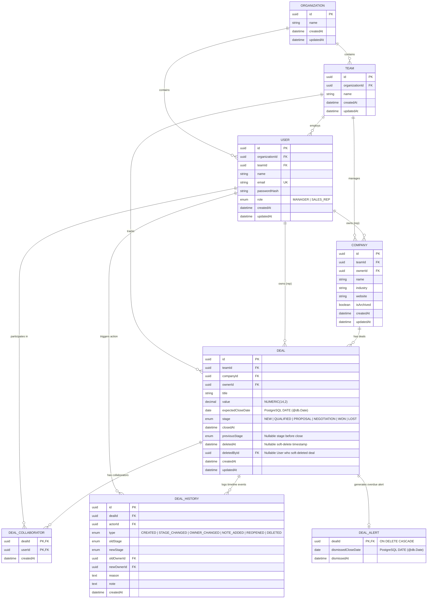

# Database Schema Specification

This document details the relational data model for the Sales CRM, including table definitions, column types, cardinalities, constraints, indexing strategies, denormalization decisions, and scalability boundaries.

---

## 1. Entity-Relationship (ER) Diagram



---

## 2. Table-by-Table Column Specifications

### 2.1 `Organization`
Establishes the enterprise boundary for future multi-organization scaling.

| Column | Type | Constraints | Description |
| :--- | :--- | :--- | :--- |
| `id` | UUID | Primary Key, default UUIDv4 | Unique organization identifier |
| `name` | VARCHAR(255) | NOT NULL | Organization name (e.g., "Busy Infotech") |
| `createdAt` | TIMESTAMP | NOT NULL, default NOW() | Record creation timestamp |
| `updatedAt` | TIMESTAMP | NOT NULL, auto-updating | Last modification timestamp |

### 2.2 `Team`
Represents the sales team boundary. Seeded with 1 team for current assignment requirements.

| Column | Type | Constraints | Description |
| :--- | :--- | :--- | :--- |
| `id` | UUID | Primary Key, default UUIDv4 | Unique team identifier |
| `organizationId` | UUID | NOT NULL, Foreign Key → `Organization.id` | Owning organization |
| `name` | VARCHAR(255) | NOT NULL | Team name (e.g., "Enterprise Sales Team") |
| `createdAt` | TIMESTAMP | NOT NULL, default NOW() | Record creation timestamp |
| `updatedAt` | TIMESTAMP | NOT NULL, auto-updating | Last modification timestamp |

### 2.3 `User`
Accounts for Sales Managers and Sales Reps.

| Column | Type | Constraints | Description |
| :--- | :--- | :--- | :--- |
| `id` | UUID | Primary Key, default UUIDv4 | Unique user identifier |
| `organizationId` | UUID | NOT NULL, Foreign Key → `Organization.id` | Organization membership |
| `teamId` | UUID | NOT NULL, Foreign Key → `Team.id` | Team membership |
| `name` | VARCHAR(255) | NOT NULL | Full name of the user |
| `email` | VARCHAR(255) | NOT NULL, UNIQUE | Sign-in email address |
| `passwordHash` | VARCHAR(255) | NOT NULL | bcrypt password hash |
| `role` | ENUM (`UserRole`) | NOT NULL | Role: `MANAGER` or `SALES_REP` |
| `createdAt` | TIMESTAMP | NOT NULL, default NOW() | Account creation timestamp |
| `updatedAt` | TIMESTAMP | NOT NULL, auto-updating | Last account update timestamp |

### 2.4 `Company`
Organizations/clients being sold to.

| Column | Type | Constraints | Description |
| :--- | :--- | :--- | :--- |
| `id` | UUID | Primary Key, default UUIDv4 | Unique company identifier |
| `teamId` | UUID | NOT NULL, Foreign Key → `Team.id` | Team ownership boundary |
| `ownerId` | UUID | NOT NULL, Foreign Key → `User.id` | Owning Sales Rep |
| `name` | VARCHAR(255) | NOT NULL | Company name (NOT globally unique; duplicate warnings handled in app) |
| `industry` | VARCHAR(100) | NOT NULL | Business industry/vertical |
| `website` | VARCHAR(255) | NULLABLE | Company website URL |
| `isArchived` | BOOLEAN | NOT NULL, default FALSE | Soft-archive flag (hides from default views) |
| `createdAt` | TIMESTAMP | NOT NULL, default NOW() | Record creation timestamp |
| `updatedAt` | TIMESTAMP | NOT NULL, auto-updating | Last modification timestamp |

### 2.5 `Deal`
The core business entity representing a commercial transaction.

| Column | Type | Constraints | Description |
| :--- | :--- | :--- | :--- |
| `id` | UUID | Primary Key, default UUIDv4 | Unique deal identifier |
| `teamId` | UUID | NOT NULL, Foreign Key → `Team.id` | Organizational scope |
| `companyId` | UUID | NOT NULL, Foreign Key → `Company.id` | Target client company |
| `ownerId` | UUID | NOT NULL, Foreign Key → `User.id` | Assigned deal owner (sales rep) |
| `title` | VARCHAR(255) | NOT NULL | Deal title/opportunity description |
| `value` | DECIMAL(14,2) | NOT NULL | Exact monetary value (`NUMERIC(14,2)`) |
| `expectedCloseDate`| DATE | NOT NULL (`DateTime @db.Date`) | Target closing calendar date (no time-of-day component) |
| `stage` | ENUM (`DealStage`) | NOT NULL, default `NEW` | Lifecycle stage: `NEW`, `QUALIFIED`, `PROPOSAL`, `NEGOTIATION`, `WON`, `LOST` |
| `closedAt` | TIMESTAMP | NULLABLE | Timestamp when deal entered `WON` or `LOST` |
| `previousStage` | ENUM (`DealStage`) | NULLABLE | Immediate preceding stage before closing (used for Manager reopen) |
| `deletedAt` | TIMESTAMP | NULLABLE | Timestamp when deal was soft-deleted (NULL = active, non-null = in trash) |
| `deletedById` | UUID | NULLABLE, Foreign Key → `User.id` | User who soft-deleted the deal |
| `createdAt` | TIMESTAMP | NOT NULL, default NOW() | Creation timestamp |
| `updatedAt` | TIMESTAMP | NOT NULL, auto-updating | Last modification timestamp |

### 2.6 `DealCollaborator`
Explicit many-to-many junction table linking Deals to assisting Sales Reps.

| Column | Type | Constraints | Description |
| :--- | :--- | :--- | :--- |
| `dealId` | UUID | Composite PK, Foreign Key → `Deal.id` (ON DELETE CASCADE) | Referenced deal |
| `userId` | UUID | Composite PK, Foreign Key → `User.id` (ON DELETE CASCADE) | Collaborating sales rep |
| `createdAt` | TIMESTAMP | NOT NULL, default NOW() | Timestamp collaboration was granted |

### 2.7 `DealHistory`
Append-only immutable audit trail for every critical deal event. **No edit or delete API endpoints exist.**

| Column | Type | Constraints | Description |
| :--- | :--- | :--- | :--- |
| `id` | UUID | Primary Key, default UUIDv4 | Unique event identifier |
| `dealId` | UUID | NOT NULL, Foreign Key → `Deal.id` | Target deal (retained permanently alongside soft-deleted deals) |
| `actorId` | UUID | NOT NULL, Foreign Key → `User.id` | User who performed the action |
| `type` | ENUM (`HistoryType`)| NOT NULL | `CREATED`, `STAGE_CHANGED`, `OWNER_CHANGED`, `NOTE_ADDED`, `REOPENED`, `DELETED` |
| `oldStage` | ENUM (`DealStage`) | NULLABLE | Pre-transition stage |
| `newStage` | ENUM (`DealStage`) | NULLABLE | Post-transition stage |
| `oldOwnerId` | UUID | NULLABLE, Foreign Key → `User.id` | Previous owner (for reassignments) |
| `newOwnerId` | UUID | NULLABLE, Foreign Key → `User.id` | New owner (for reassignments) |
| `reason` | TEXT | NULLABLE | Mandatory reason when moving backward |
| `note` | TEXT | NULLABLE | Free-text note added by rep/manager |
| `createdAt` | TIMESTAMP | NOT NULL, default NOW() | Immutable event occurrence timestamp |

### 2.8 `DealAlert`
Tracks dismissal state for overdue deal notifications.

| Column | Type | Constraints | Description |
| :--- | :--- | :--- | :--- |
| `dealId` | UUID | Primary Key, Foreign Key → `Deal.id` (**ON DELETE CASCADE**) | Target overdue deal |
| `dismissedCloseDate` | DATE | NOT NULL (`DateTime @db.Date`) | The exact `expectedCloseDate` that was dismissed by the deal owner |
| `dismissedAt` | TIMESTAMP | NOT NULL, default NOW() | Timestamp owner dismissed the current alert |

---

## 3. Relationships & Cardinalities

- **Organization → Team**: `1 : N` (An organization has one or more teams).
- **Organization → User**: `1 : N` (Users belong directly to an organization).
- **Team → User**: `1 : N` (A team contains multiple managers and sales reps).
- **Team → Company**: `1 : N` (Companies belong to a team boundary).
- **Team → Deal**: `1 : N` (Deals belong to a team boundary).
- **User (Owner) → Company**: `1 : N` (A sales rep owns multiple companies).
- **User (Owner) → Deal**: `1 : N` (A sales rep owns multiple deals).
- **User (Deleter) → Deal**: `1 : N` (A user can soft-delete deals).
- **Company → Deal**: `1 : N` (A company has multiple deals; every deal belongs to exactly one company).
- **Deal ↔ User (Collaborator)**: `N : M` (A deal has multiple collaborating reps; a rep collaborates on multiple deals; resolved via `DealCollaborator` junction table).
- **Deal → DealHistory**: `1 : N` (A deal has an ordered timeline of immutable events; permanently retained through soft deletion).
- **User (Actor) → DealHistory**: `1 : N` (A user triggers multiple audit events).
- **Deal → DealAlert**: `1 : 0..1` (A deal optionally has a dismissal record).

---

## 4. Date Modeling: `Deal.expectedCloseDate`

`Deal.expectedCloseDate` is modeled explicitly as a **PostgreSQL `DATE`** (Prisma `DateTime @db.Date`), **NOT a timestamp**.

### Rationale:
1. **Business Semantics**: Sales expected close dates represent target calendar days (e.g., "2026-09-30"), not arbitrary milliseconds or times of day.
2. **Elimination of Timezone Skew**: Storing a close date as a full ISO timestamp with time (e.g. `2026-09-30T00:00:00.000Z`) causes subtle off-by-one calendar bugs when queried from browsers in different UTC offsets (e.g. converting UTC midnight to 5:30 AM in IST or 7:00 PM the previous evening in EST).
3. **Clean Date Arithmetic for Overdue Alerts**: Comparing `expectedCloseDate < CURRENT_DATE` operates cleanly at the day boundary without time-of-day discrepancy.

---

## 5. Sales-Rep Company & Deal Visibility Rules

The assignment strictly dictates that Sales Reps **cannot** browse all companies across the sales organization. Visibility is enforced at the repository query level:

### Rules:
1. **Sales Manager**:
   - Has full visibility across all companies and all deals within the team.
2. **Sales Rep**:
   - Deals: Can view **only** deals where they are the assigned `ownerId` OR listed as a collaborator in `DealCollaborator`.
   - Companies: Can view **only**:
     a) Companies where they are the primary `ownerId`, AND/OR
     b) Companies associated with deals they are legitimately allowed to view (as deal owner or collaborator).

### Explicit Repository Scoping:

#### 1. Raw SQL Representation:
```sql
-- Sales Rep Company Scoping Query
SELECT c.*
FROM "Company" c
WHERE c."teamId" = :teamId
  AND (
    c."ownerId" = :userId
    OR c."id" IN (
      SELECT d."companyId"
      FROM "Deal" d
      LEFT JOIN "DealCollaborator" dc ON dc."dealId" = d."id"
      WHERE d."ownerId" = :userId OR dc."userId" = :userId
    )
  )
```

#### 2. Prisma ORM Representation (`CompanyRepository`):
```typescript
// Explicit repository filter based on session role and userId
const whereClause = user.role === 'MANAGER'
  ? { teamId: user.teamId }
  : {
      teamId: user.teamId,
      OR: [
        { ownerId: user.id },
        {
          deals: {
            some: {
              OR: [
                { ownerId: user.id },
                { collaborators: { some: { userId: user.id } } }
              ]
            }
          }
        }
      ]
    };

const accessibleCompanies = await prisma.company.findMany({
  where: whereClause,
  include: { owner: true }
});
```

---

## 6. Deal Deletion & `DealHistory` Deletion Semantics: Soft Delete Architecture

A critical architectural tension exists between two explicit requirements:
1. **Goal 3**: *"Deals can be created, edited, and deleted."*
2. **Goal 9**: *"History you cannot rewrite. Nothing in this timeline can be edited or deleted after the fact, including by sales managers."*

### Decision: Application-Level Soft Deletion
To resolve this tension with full integrity, **Deals use Soft Deletion**:
- The application-level meaning of "delete deal" is that the deal transitions into a deleted state rather than being physically removed from the database.
- A deleted deal remains a real `Deal` row in the database, with two explicit soft-delete columns:
  - `deletedAt: TIMESTAMP NULLABLE` — the timestamp when deletion occurred (`NULL` = active deal, non-null = in trash).
  - `deletedById: UUID NULLABLE` — foreign key reference to `User.id` identifying who performed the deletion.
- Its complete `DealHistory` timeline remains permanently available and intact.
- Normal/active queries exclude deleted deals by default: `WHERE "deletedAt" IS NULL`.
- A dedicated **Deleted / Trash** view queries deleted deals: `WHERE "deletedAt" IS NOT NULL`.
- The deletion event itself is recorded as a new immutable event in `DealHistory`:
  - `dealId`: Referenced deal.
  - `actorId`: User who deleted the deal (`deletedById`).
  - `type`: `DELETED`.
  - `createdAt`: Timestamp of deletion.
- The `DELETED` history record is append-only and strictly immutable, exactly like `CREATED`, `STAGE_CHANGED`, `OWNER_CHANGED`, `NOTE_ADDED`, and `REOPENED`.
- Soft deletion does **not** remove or truncate any previous history.

### Timeline Lifecycle Flow
Conceptually, the deal timeline progresses through an append-only sequence:
```
CREATED
  ↓
STAGE_CHANGED
  ↓
OWNER_CHANGED
  ↓
NOTE_ADDED
  ↓
DELETED  [deleted/trash state visual indication]
```
*(Note: Visual indicators such as trash badges or icons are presentation details handled in the frontend UI; the domain model tracks typed events.)*

### Relationship & Data Retention Semantics
- **No Cascading Destruction**: We do **NOT** use `ON DELETE CASCADE` from `Deal` → `DealHistory`. Since deals are soft-deleted and remain in the database, `DealHistory` remains permanently associated with `Deal`.
- **Collaborators and Alerts**: `DealCollaborator` and `DealAlert` records remain associated with the deal row, preserving all relationship metadata unless an explicit cleanup policy is introduced later.
- **Restore Capability**: The architecture leaves clean room for restoring a deleted deal from Trash (e.g. setting `deletedAt = NULL`, `deletedById = NULL`). However, because the current requirements do not specify exact restore permissions or endpoints for deals, detailed restore behavior is marked **TBD** and not implemented prematurely.
- **Rejection of Hard Deletion**: Hard/physical `DELETE` of deals is rejected because destroying deal rows would sever or orphan the immutable timeline mandated by Goal 9. Background purge scripts, automated hard retention jobs, distributed event sourcing, and separate audit databases are explicitly avoided to keep the system simple and appropriate for the assignment.

### Distinct Architectural Mechanisms: Company Archiving vs. Deal Deletion
Company archiving and Deal deletion are two separate, deliberate concepts:
- **Company Archiving**: Uses `isArchived: boolean`. Archiving hides an inactive company from default active views without destroying its deals (Goal 2). Companies have an explicit restore workflow (`/archive`, `/restore`).
- **Deal Deletion**: Uses `deletedAt: timestamp?` and `deletedById: uuid?`. Deleting a deal moves it to Deleted/Trash while preserving its complete history and recording a `DELETED` audit event (Goals 3 & 9).

---

## 7. Database vs. Application Constraints

| Concern | Enforced By | Mechanism / Implementation | Why the Line Was Drawn Here |
| :--- | :---: | :--- | :--- |
| **Referential Integrity** | **Database** | Foreign Keys (`CASCADE` for collaborators/alerts; soft delete retains Deal and History rows) | Prevents orphaned rows and guarantees entity relationships at physical storage level. |
| **Entity Identification** | **Database** | UUID Primary Keys, Composite PK on `(dealId, userId)` | Prevents duplicate collaborator rows and guarantees global record uniqueness. |
| **Email Uniqueness** | **Database** | `UNIQUE` index on `User.email` | Strict collision prevention for authentication credentials. |
| **Company Name Uniqueness** | **Application** | Duplicate/similarity warning on creation | Legitimate businesses may share identical names. Hard DB unique constraints would block valid CRM workflows. |
| **Valid Stage Enum** | **Database** | PostgreSQL Native `ENUM` | Rejects corrupt or undefined string states before write. |
| **Stage Transition Flow** | **Application** | `DealTransitionPolicy` (Domain Layer) | Transition rules (forward 1-step, backward 1-step, closed restrictions) depend on complex business context. |
| **Backward Move Reason** | **Application** | Zod Schema + `DealTransitionPolicy` | Database `NOT NULL` cannot discern forward from backward transitions; the domain policy enforces non-empty strings conditionally. |
| **Collaborator Management** | **Application** | `DealPolicy` (Domain Layer) | Only Sales Managers and Deal Owners can add/remove collaborators. Collaborators cannot manage other collaborators. |
| **Deal Reopen Authorization** | **Application** | `DealTransitionPolicy` + Role Guard | Reopen logic checks that `req.user.role === 'MANAGER'` before allowing state inversion. |
| **Server-Side Visibility** | **Application** | Query scoping in Repositories | Rep visibility (`ownerId == user.id || collaborator`) requires dynamic SQL/Prisma `WHERE` clauses based on JWT session context. |
| **Overdue Alert Dismissal Cycle** | **App & DB** | Calendar Date comparison with `dismissedCloseDate` | Compares `expectedCloseDate != dismissedCloseDate` between PostgreSQL `DATE` types. |
| **Immutability of Audit History** | **App & DB** | Append-only `DealHistory`; soft deletion logs `DELETED`; zero update/delete API routes | Defense-in-depth: soft deletion preserves physical records, application prevents modification endpoints. |

---

## 8. Deliberate Denormalization & Derived Fields

### 8.1 `Deal.previousStage` (Deliberately Denormalized)
- **Why**: When a deal reaches `WON` or `LOST`, its immediate predecessor stage (typically `NEGOTIATION`) is copied into `previousStage`. When a Manager reopens the deal, the system restores `deal.stage = deal.previousStage` in an $O(1)$ transactional operation without requiring an expensive table scan across `DealHistory` to locate the latest stage event.
- **Audit Parity**: `DealHistory` remains the authoritative append-only log, recording the `REOPENED` event explicitly.

### 8.2 `weightedValue` (Deliberately NOT Stored)
- **Why**: The weighted value of a deal is calculated as `value * stageProbability` (e.g., Proposal = 50% of ₹10,00,000 = ₹5,00,000). Storing this in a column would require retroactive bulk updates across thousands of rows whenever stage probabilities change or deal values fluctuate. It is derived on the fly in SQL queries and dashboard aggregations.

### 8.3 Overdue Alert Status (Deliberately NOT Persisted as Static Flags)
- **Why**: Storing an `isOverdue: boolean` column would require scheduled background cron jobs to flip bits daily at midnight. Instead, overdue status is derived dynamically on active deals:
  ```sql
  SELECT d.*
  FROM "Deal" d
  LEFT JOIN "DealAlert" da ON da."dealId" = d."id"
  WHERE d."stage" NOT IN ('WON', 'LOST')
    AND d."deletedAt" IS NULL
    AND d."expectedCloseDate" < CURRENT_DATE
    AND (
      da."dealId" IS NULL
      OR d."expectedCloseDate" != da."dismissedCloseDate"
    )
  ```

---

## 9. Targeted Indexing Strategy

```prisma
// Recommended Prisma Indexes
model Deal {
  // ... fields ...
  @@index([teamId, deletedAt])
  @@index([teamId, stage])
  @@index([ownerId])
  @@index([companyId])
  @@index([expectedCloseDate])
  @@index([updatedAt])
}

model Company {
  // ... fields ...
  @@index([teamId, isArchived])
  @@index([ownerId])
  @@index([name])
}

model DealHistory {
  // ... fields ...
  @@index([dealId, createdAt(sort: Desc)])
}
```

---

## 10. What Would Break First at 100x Data Volume?

If data grows from 1,000 deals to 100,000+ deals and 1,000,000+ history events:

1. **`DealHistory` Table Growth**:
   - *Failure Mode*: Unbounded growth of history rows slowing down timeline fetches and join queries.
   - *Mitigation*: Index on `(dealId, createdAt DESC)` ensures timeline reads remain fast. At extreme scale, PostgreSQL declarative table partitioning by `createdAt` or range hash on `dealId` can be introduced without application code changes.
2. **Dashboard Aggregations**:
   - *Failure Mode*: Calculating 8-week win trends and stage sums by scanning all deals in real time.
   - *Mitigation*: Composite indexes on `(teamId, stage, closedAt)` satisfy aggregations via index-only scans.
3. **In-Memory CSV Pipeline Exports**:
   - *Failure Mode*: Fetching 50,000 open deals into Node.js heap memory causes Out-Of-Memory (OOM) crashes.
   - *Mitigation*: Implement cursor-based database streaming with Node.js Transform streams to pipe CSV chunks directly to the HTTP response.
4. **Text Search on Title and Company Name**:
   - *Failure Mode*: `ILIKE '%query%'` triggers sequential table scans across large tables.
   - *Mitigation*: Add PostgreSQL trigram (`pg_trgm`) GIN indexes: `CREATE INDEX deal_title_trgm_idx ON "Deal" USING gin (title gin_trgm_ops);`.
